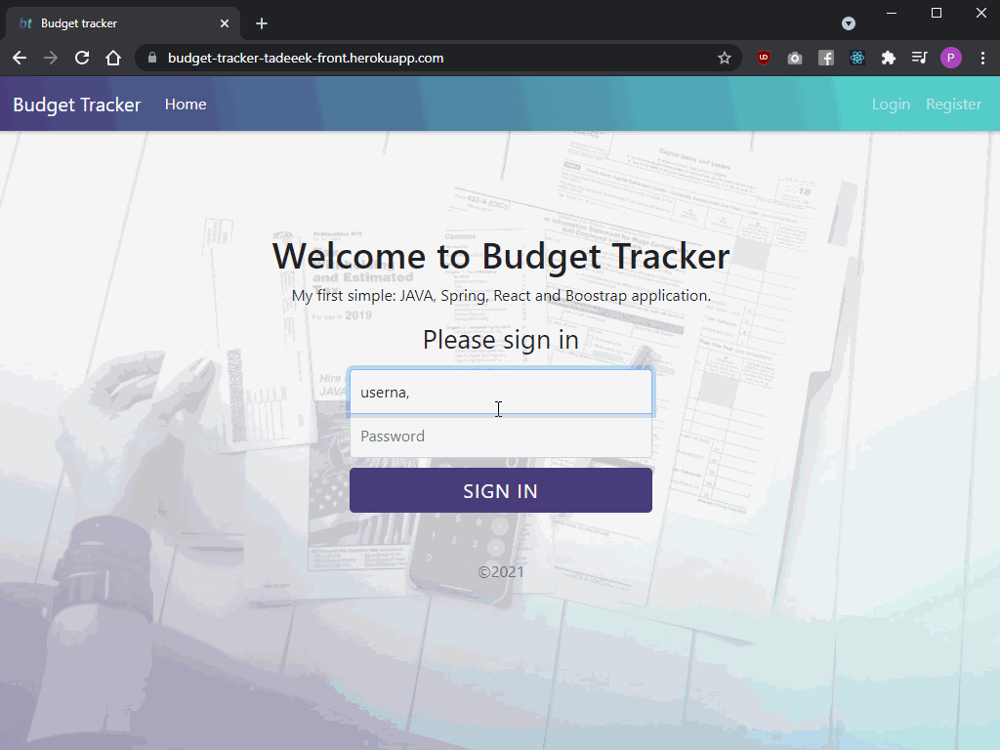

## Budget Tracker

Simple web application that lets you track your expenses. Manage them by creating your custom categories and see analysys of the expenses. Web app is secured by Spring Security with custom login form and user registration option.

## Table of contents

- [General info](#general-info)
- [Screencast](#screencast)
- [Technologies](#technologies)
- [Status](#status)

## General info

Demo is available at: https://budget-tracker-tadeeek-front.herokuapp.com/
Register new user or login to existing: username/creativepass123
Please wait when login, heroku is very slow.

## Screencast

## Technologies

- Java
- Spring
- Spring Security
- React
- Chart.js
- Bootstrap
- HTML5
- CSS3
- PostgreSQL

## Status

Project is: _in development_
